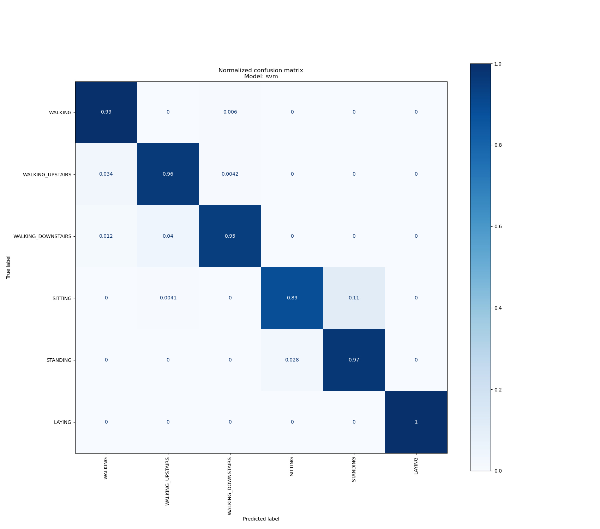
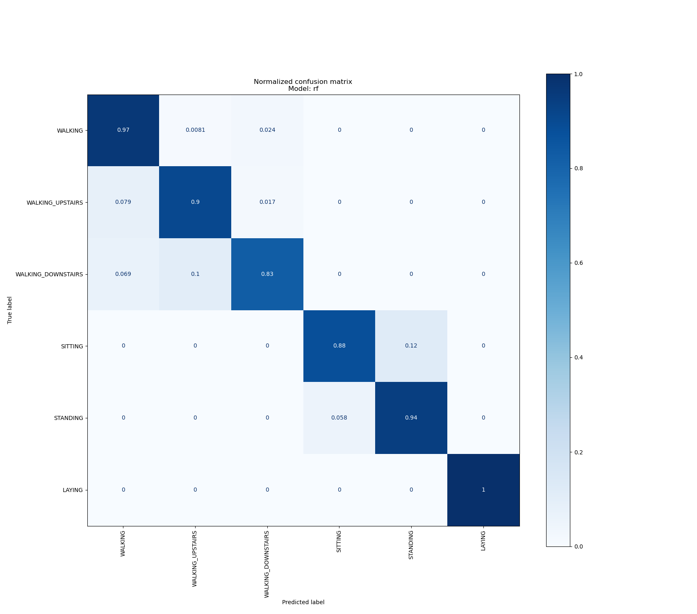

.. vim: set fileencoding=utf-8 :

.. _activities_userguide:

============
 User Guide
============

You have the choice between two classifiers: an SVM (default) or a random 
forest. By default the classifier will use predefined parameters 
but you can also use the gridsearch option to find new parameters. The analysis
results will be saved by default in a *results* folder but you can also use
the dedicated parameter to customize it.

Here are two examples of commands you can use::

    # Train an SVM with predefined parameters and save the analysis 
    # in the "analysis_results" folder
    (activities) $ python run.py -model svm -gridsearch n -output-folder analysis_results

    # Train a random forest with gridsearch and save the analysis in 
    # the "results" folder
    (activities) $ python run.py -model rf -gridsearch y -output-folder results

For your reference, our tables and figures are repeated below, so you can 
check the reproducibility of our solution.

Results with the SVM model
--------------------------

For this experiment, we used an SVM model with the following parameters 
(kernel = "rbf", gamma = 0.0001, C = 1000).

=================  ==============  ================  ==========
  Precision (avg)    Recall (avg)    F1 score (avg)    Accuracy
=================  ==============  ================  ==========
            0.961           0.961             0.961       0.961
=================  ==============  ================  ==========

Results with the random forest model
------------------------------------

For this experiment, we used a random forest model with the following parameters 
(n_estimators = 50, max_depth = 25, min_samples_split = 2, min_samples_leaf = 4,
bootstrap = True).

=================  ==============  ================  ==========
  Precision (avg)    Recall (avg)    F1 score (avg)    Accuracy
=================  ==============  ================  ==========
            0.924           0.924             0.924       0.924
=================  ==============  ================  ==========

